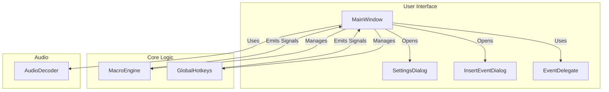

# Macro Recorder Documentation

Welcome to the developer documentation for the Macro Recorder application. This documentation provides a comprehensive overview of the application's architecture, features, and inner workings.

## Development Setup

To get started with the development of this application, you will need to have the Qt library installed.

### IntelliSense Configuration (for VS Code)

This project includes a `.vscode/c_cpp_properties.json` file to aid with C/C++ IntelliSense in Visual Studio Code. This file is configured with a standard Qt installation path for Windows (`C:/Qt/6.2.4/mingw_64/include/**`).

If your Qt installation is located elsewhere, you will need to update the `includePath` in the `.vscode/c_cpp_properties.json` file to match your system's configuration.

## Architecture Overview

## Modules

*   [Audio](./audio.md)
*   [Core](./core.md)
*   [UI](./ui.md)

This documentation is intended to be a living document. As the application evolves, this documentation will be updated to reflect the latest changes and additions.