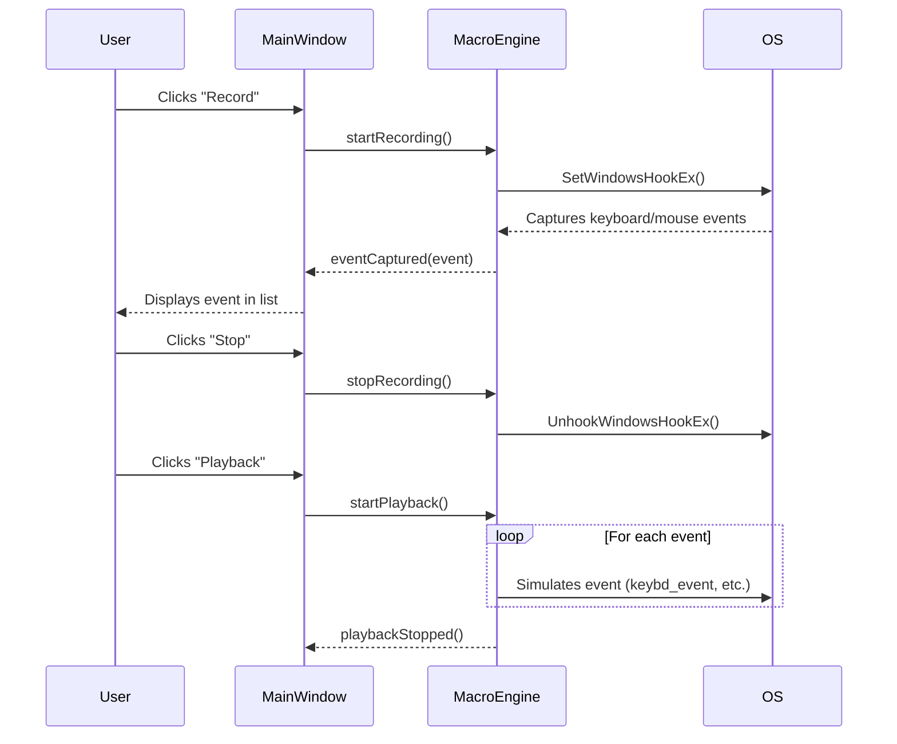

# Core Module

The Core module is responsible for the main logic of the macro recorder. It handles macro recording, playback, and global hotkeys.

## Files

*   `global_hotkeys.h` / `global_hotkeys.cpp`: Manages the global hotkeys for starting and stopping macro recording and playback.
*   `macro_engine.h` / `macro_engine.cpp`: The heart of the application, this class handles the recording and playback of user input events.

## Key Structures and Enums

### `EventType` (enum)
Defines the type of event that can be recorded.
- `KEY_PRESS`
- `KEY_RELEASE`
- `MOUSE_MOVE`
- `MOUSE_PRESS`
- `MOUSE_RELEASE`
- `MOUSE_SCROLL`
- `WAIT`

### `MacroEvent` (struct)
Represents a single recorded event. It contains the following fields:

- **`type`**: The type of the event (from `EventType`). This determines which of the other fields are relevant for this event.
- **`key_code`**: The virtual key code for keyboard events (e.g., `VK_SHIFT`, `0x41` for 'A').
- **`button`**: The mouse button for mouse press and release events (e.g., `Qt::LeftButton`, `Qt::RightButton`).
- **`position`**: The global screen coordinates (`QPoint`) for mouse move, press, and release events.
- **`scroll_delta`**: The distance and direction of the scroll wheel movement (`QPoint`). A positive `y()` value indicates scrolling forward, while a negative value indicates scrolling backward.
- **`delay_ms`**: The delay in milliseconds before this event is executed. This is crucial for replaying the macro with the same timing as the recording.

## Key Classes

### `MacroEngine`

The `MacroEngine` class is the core of the macro functionality. It handles recording, storing, and playing back user actions. It operates using low-level system hooks to capture keyboard and mouse events globally.

#### Implementation Details

**Recording:**
- Recording is initiated by `startRecording()`, which calls `installHook()`.
- `installHook()` uses the Windows API function `SetWindowsHookEx` to install low-level keyboard and mouse hooks (`WH_KEYBOARD_LL` and `WH_MOUSE_LL`). These hooks call the static callback functions `lowLevelKeyboardProc` and `lowLevelMouseProc` respectively.
- The callback functions capture the event details (key codes, mouse positions, etc.), package them into a `MacroEvent` struct, and append them to the `recordedEvents` vector.
- The time between events is also recorded to ensure accurate playback.
- `stopRecording()` calls `uninstallHook()` to remove the hooks and stop capturing events.

**Playback:**
- `startPlayback()` creates a new thread to handle the playback process, preventing the GUI from freezing.
- The playback thread iterates through the `recordedEvents` vector.
- For each event, it first sleeps for the recorded `delay_ms` to replicate the original timing.
- It then uses Windows API functions like `keybd_event`, `SetCursorPos`, and `mouse_event` to simulate the original keyboard and mouse actions.
- The playback can be looped by setting the `loopCount` and `loopInterval_ms`. A `loopCount` of 0 results in infinite looping.
- `stopPlayback()` sets the `isPlaying` flag to `false`, which terminates the playback loop in the thread.

**Public Methods:**
- `startRecording()`: Begins capturing user input.
- `stopRecording()`: Stops capturing user input.
- `startPlayback()`: Starts playing back the recorded macro.
- `stopPlayback()`: Stops the playback.
- `setLoopSettings(int count, int interval)`: Configures the number of times the macro should loop and the interval between loops.
- `getRecordedEvents() const`: Returns the vector of recorded events.
- `setRecordedEvents(const QVector<MacroEvent> &events)`: Sets the recorded events, allowing for loading macros.
- `insertEvent(const MacroEvent &event)`: Inserts a new event into the macro sequence.

**Signals:**
- `eventCaptured(const MacroEvent &event)`: Emitted when a new event is recorded.
- `recordingStarted()`: Emitted when recording starts.
- `recordingStopped()`: Emitted when recording stops.
- `playbackStarted()`: Emitted when playback starts.
- `playbackStopped()`: Emitted when playback stops.

## Recording and Playback Flow

### `GlobalHotkeys`

The `GlobalHotkeys` class provides a way to trigger core application functions (like starting or stopping recording and playback) using system-wide hotkeys. This allows the user to control the application even when it's not in focus.

#### Implementation Details

- **Registration**: The constructor calls `registerHotkeys()`, which uses the Windows API function `RegisterHotKey` to register the hotkeys. By default, these are `Ctrl+R` for recording and `Ctrl+T` for playback.
- **Event Filtering**: The class implements the `QAbstractNativeEventFilter` interface, which allows it to intercept native window events. The `nativeEventFilter` function checks for `WM_HOTKEY` messages from the operating system.
- **Signal Emission**: When a registered hotkey is pressed, the `nativeEventFilter` function identifies which hotkey was activated and emits the corresponding signal (`recordHotkeyActivated` or `playbackHotkeyActivated`). These signals are then connected to the appropriate slots in the `MainWindow`.
- **Unregistration**: The destructor ensures that the hotkeys are unregistered using `UnregisterHotKey` to clean up resources and prevent conflicts.

**Public Methods:**
- `nativeEventFilter(...)`: Listens for native system events to detect when a registered hotkey is pressed.

**Signals:**
- `recordHotkeyActivated()`: Emitted when the record hotkey is pressed.
- `playbackHotkeyActivated()`: Emitted when the playback hotkey is pressed.